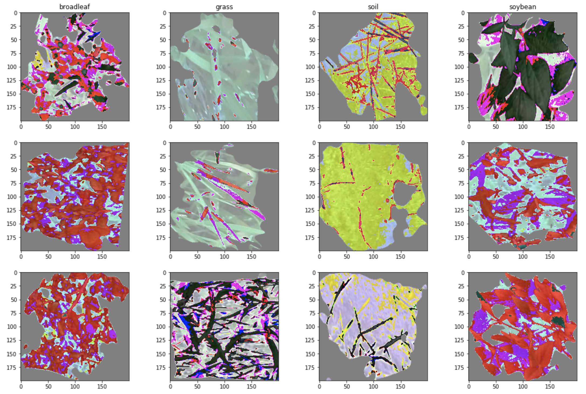

# Weed Detection in Soybean Crops using NN's (Neural Networks):

Technologies used include [Kaggle Crops Dataset](https://www.kaggle.com/fpeccia/weed-detection-in-soybean-crops), Python, Google Colab/Jupyter Notebook..

